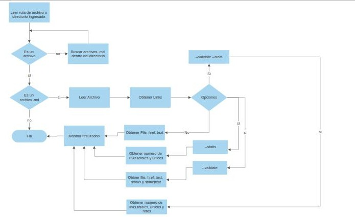
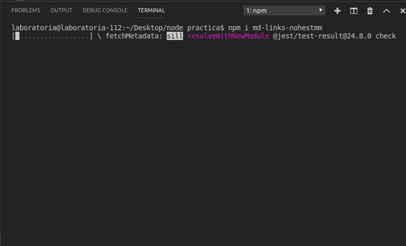

# Markdown Links / md-links-nohestmm 

## ¿Qué es Markdown? 

Es un lenguaje de marcado, que se utiliza para publicar contenido, con etiquetas y delimitar cuando es un título, una imagen, un párrafo, un texto cursivo y links, entre otros. Es recurrente que los links dejen de funcionar, por lo que de allí surge la necesidad de la creación de esta librería, de modo que permita determinar cuáles están operando aun.

La siguiente librería tiene como finalidad permitirle al usuario examinar archivos o directorios que contengan alguna extensión .md y conocer el estatus, la cantidad de links, el origen, la referencia y los links que no están en funcionamiento.

## ¿Cómo funciona md-links-nohestmm v0.1.1?  

La aplicación permite examinar links colocando en la terminal el comando md-links  `archivo.md` o md-links `directorio`, lo que mostrará un objeto de links contenidos dentro de el o los archivos .md, encontrados. También permite utilizar dos opciones `--validate o --v` y `--stats o --v`. La primera para mostrar los links con su estatus y la referencia a la cual hace, y la segunda muestra la totalidad de los links y cuales son únicos. 

Por otra parte se permite al usuario combinar las opciones validate y stats, ya sea md-links ` archivo o directorio --s --v` o  md-links ` archivo o directorio --v --s`, como también  md-links ` archivo o directorio --stats --validate` o ` archivo o directorio --validate --stats`. El resultado de esto sería la cantidad de links examinados, los únicos y los que están rotos.

# Diagrama de flujo

A continuación se muestra el diagrama de flujo en el cual esta basado el funcionamiento de la libreria: 

## ¿Cómo instalar md-links-nohestmm? 

Para la instalación debes colocar en la terminal, estando dentro de tu carpeta de proyecto, el siguiente comando `npm i md-links-nohestmm`

A continuación se ejecutará la descarga del archivo de la siguiente manera:

Listo! Ya instalaste el md-links- en tu archivo.

## Ejemplo de uso 

Aquí te dejo un ejemplo de como hacer uso de la librería.

* Leer un `archivo.md` 
  
1. Sin opciones
   
   

2. Con opción `--validate o --v`

   

3. Con opción `--stats o --s`

   

4. Con las opciones `--validate --stats`, `--stats --validate`, `--s --v`, `--v --s`
   
   

* Leer un `directorio`

1. Sin opciones
   
     

2. Con opción `--validate o --v`

   

3. Con opción `--stats o --s`

   

4. Con las opciones `--validate --stats`, `--stats --validate`, `--s --v`, `--v --s`
   
    
   
# Aspectos técnicos

Para el desarrollo de la aplicación se utilizaron las siguientes dependencias:

* chalk
* eslint
* eslint-plugin-jest
* filehound
* jest
* marked
* node-fetch

# Planificación

Para llevar a cabo el desarrollo de la librería, se administraron las diferentes tareas utilizando Trello, el cual se puede consultar en el siguiente enlace [Click Aqui](https://trello.com/b/J157uGEt/mark-down)

Autora : <<<<<<<Nohemi Martinez>>>>>>> Laboratoria 
   

   