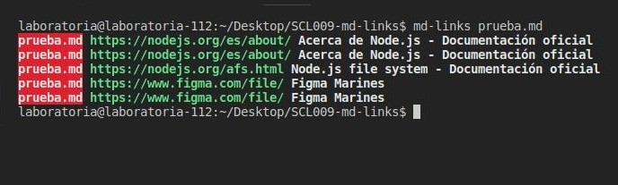
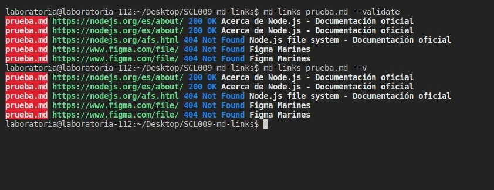
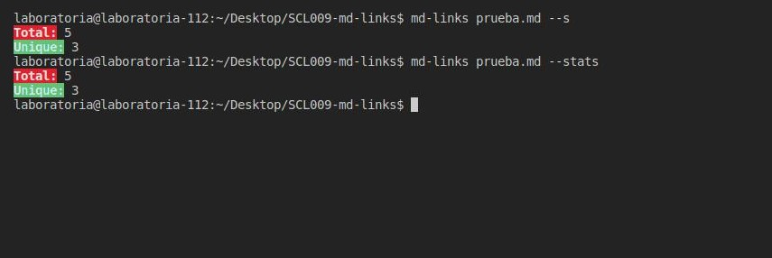
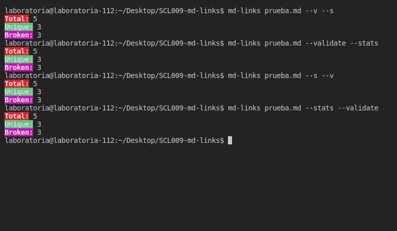
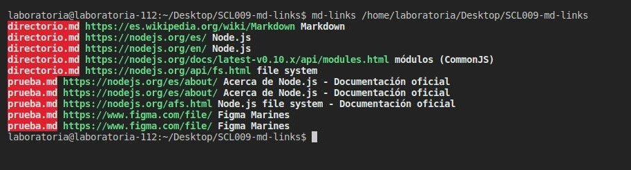
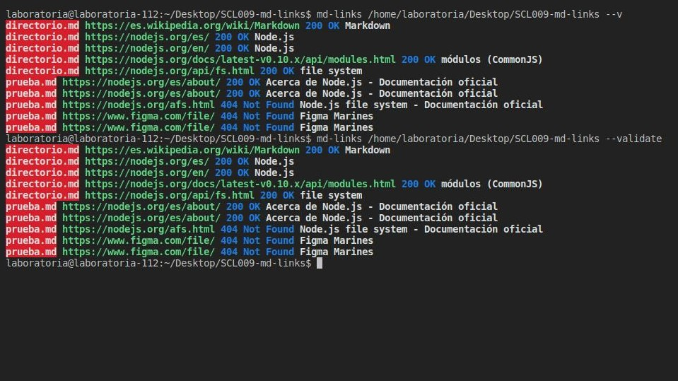
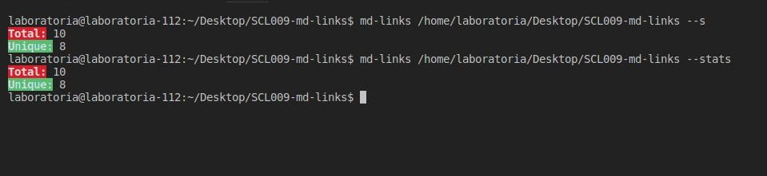
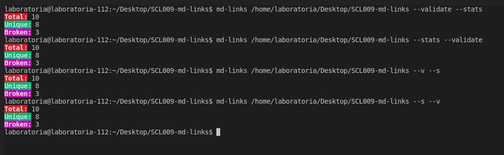

# Markdown Links / md-links-nohestmm 

## ¿Qué es Markdown? 

Es un lenguaje de marcado, que se utiliza para publicar contenido, con etiquetas y delimitar cuando es un título, una imagen, un párrafo, un texto cursivo y links, entre otros. Es recurrente que los links  dejen de funcionar, por lo que de allí surge la necesidad de la creacion de esta librería, de modo que permita determinar cuáles estan operando aun.

La siguiente librería tiene como finalidad permitirle al usuario examinar archivos o directorios que contengan alguna extensión .md y conocer el estatus, la cantidad de links, el origen, la referencia y los links que no estan en funcionamiento.

## ¿Cómo funciona md-links-nohestmm v0.1.1?  

La aplicación permite examinar links colocando en la terminal el comando md-links  `archivo.md` o md-links `directorio`, lo que mostrará un objeto de links contenidos dentro de el o los archivos md, encontrados. Tambien permite utilizar dos opciones `--validate o --v` y `--stats o --v`. La primera para mostrar los links con su estatus y la referencia a la cual hace, y la segunda muestra la totalidad de los links y cuales son únicos. 

Por otra parte se permite al usurio combinar las opciones validate y stats, ya sea md-links ` archivo o directorio --s --v` o  md-links ` archivo o directorio --v --s`, como tambien  md-links ` archivo o directorio --stats --validate` o ` archivo o directorio --validate --stats`. El resultado de esto seria la cantidad de links examinados, los unico y los que estan rotos.

## ¿Cómo instalar md-links-nohestmm? 

Para la instalación debes colocar en la terminal, estando dentro de tu carpeta de proyecto, el siguiente comando `npm i md-links-nohestmm`

A continuación se ejecutará la descarga del archivo de la siguiente manera:

Listo! Ya instalaste el md-links- en tu archivo.

## Ejemplo de uso 

Aquí te dejo un ejemplo de como hacer uso de la librería.

* Leer un `archivo.md` 
  
1. Sin opciones
   
   

2. Con opción `--validate o --v`

   

3. Con opción `--stats o --s`

   

4. Con las opciones `--validate --stats`, `--stats --validate`, `--s --v`, `--v --s`
   
   

* Leer un `directorio`

1. Sin opciones
   
     

2. Con opción `--validate o --v`

3. Con opción `--stats o --s`

4. Con las opciones `--validate --stats`, `--stats --validate`, `--s --v`, `--v --s`
   

   

   

   